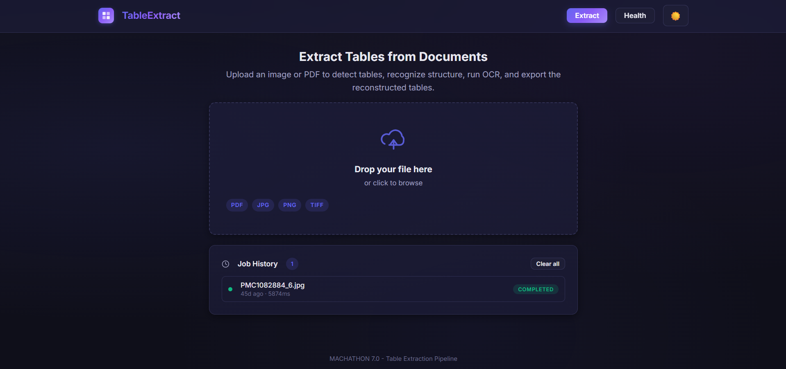
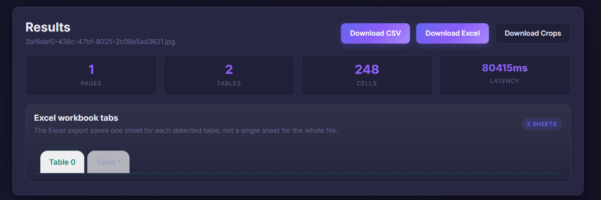
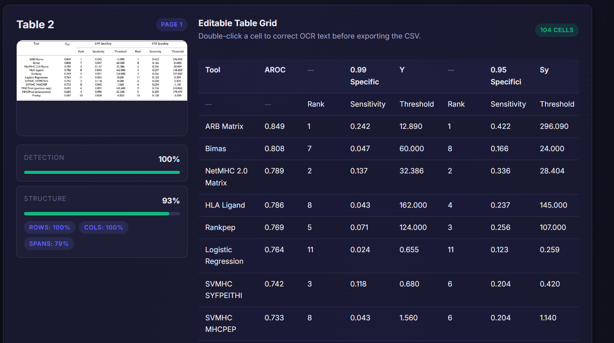
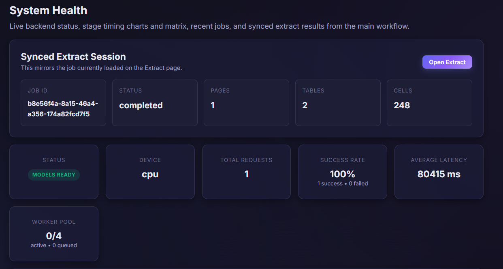
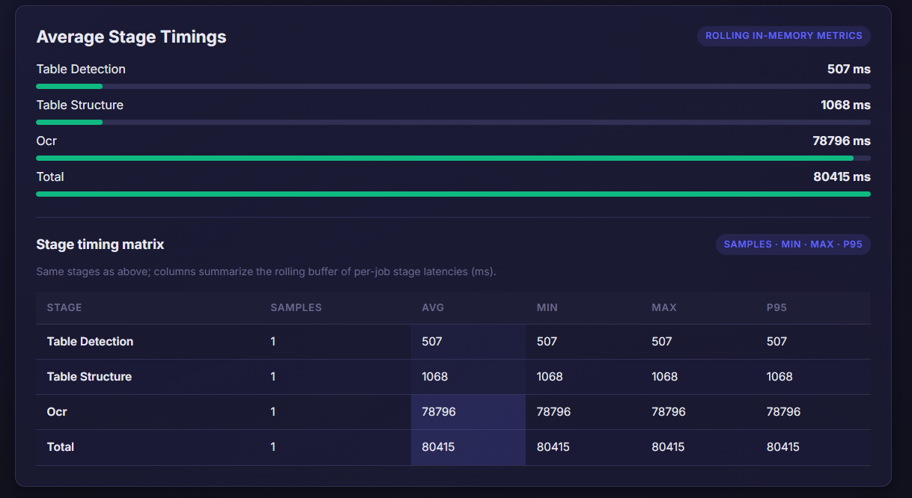
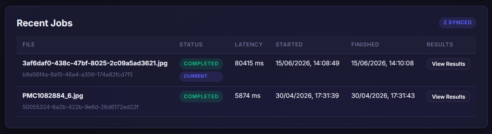

<p align="center">
  
</p>

<h1 align="center">📊 TableExtract</h1>

<p align="center">
  <b>End-to-end table extraction from images &amp; PDFs — detect, recognize, OCR, and export.</b>
  <br/>
  <sub>Built for <b>MACHATHON 7.0</b> &nbsp;·&nbsp; FastAPI + React + PyTorch</sub>
</p>

<p align="center">
  
  
  
  
  
</p>

---

## ✨ What Is This?

**TableExtract** is a production-grade web application that extracts structured tabular data from document images and PDFs. Upload a file, and the system automatically:

1. **Detects** every table in the document using a deep-learning table-detection model
2. **Recognizes** the row/column/span structure of each table via a structure-recognition model
3. **Reads** cell contents with TrOCR (Transformer-based Optical Character Recognition)
4. **Exports** clean, editable results as **CSV**, **Excel** (one sheet per table), or **cropped table images**

The entire pipeline runs through a modern React frontend backed by a high-performance FastAPI server, with non-blocking background processing, real-time progress tracking, and a full health monitoring dashboard.

---

## 🖼️ Screenshots

### Upload & Extract

Drag-and-drop or click to upload images (JPG, PNG, TIFF) and PDFs. Job history is persisted across sessions.

<p align="center">
  
</p>

---

### Results & Export

Instantly view extraction summaries — pages, tables, cells, and latency — with one-click download in CSV, Excel, or cropped image formats. Each detected table gets its own Excel sheet.

<p align="center">
  
</p>

---

### Editable Table Grid

Review every detected table side-by-side with the original crop. Double-click any cell to correct OCR text before exporting. Detection and structure confidence scores are displayed in real time.

<p align="center">
  
</p>

---

### System Health Dashboard

Live monitoring of backend status, model readiness, total requests, success rate, average latency, and worker pool utilization — all in a single glance.

<p align="center">
  
</p>

---

### Stage Timing Analytics

Per-stage latency breakdown (Table Detection → Structure Recognition → OCR) with rolling in-memory metrics, bar charts, and a detailed timing matrix showing samples, avg, min, max, and P95.

<p align="center">
  
</p>

---

### Recent Jobs

Track all processed files with status, latency, timestamps, and one-click result viewing. Jobs synced from the health dashboard are highlighted.

<p align="center">
  
</p>

---

## 🏗️ Architecture

```
┌─────────────────────────────────────────────────────────────┐
│                     React Frontend (Vite)                   │
│  ┌──────────┐  ┌──────────────┐  ┌────────────────────────┐ │
│  │  Upload   │  │   Results    │  │   Health Dashboard     │ │
│  │  + D&D    │  │   Viewer     │  │   + Stage Timings      │ │
│  └──────────┘  └──────────────┘  └────────────────────────┘ │
└─────────────────────────┬───────────────────────────────────┘
                          │  REST API
┌─────────────────────────▼───────────────────────────────────┐
│                  FastAPI Backend (Uvicorn)                   │
│  ┌──────────┐  ┌──────────────┐  ┌────────────────────────┐ │
│  │  Upload   │  │   Results    │  │   Health               │ │
│  │  Router   │  │   Router     │  │   Router               │ │
│  └─────┬────┘  └──────────────┘  └────────────────────────┘ │
│        │                                                     │
│  ┌─────▼────────────────────────────────────────────────┐   │
│  │        ThreadPoolExecutor (Non-Blocking Pipeline)     │   │
│  │  ┌──────────┐  ┌──────────────┐  ┌────────────────┐  │   │
│  │  │  Table    │  │  Structure   │  │    TrOCR       │  │   │
│  │  │  Detect   │──│  Recognize   │──│    (Batch)     │  │   │
│  │  │  (DETR)   │  │  (DETR)      │  │               │  │   │
│  │  └──────────┘  └──────────────┘  └────────────────┘  │   │
│  └──────────────────────────────────────────────────────┘   │
│  Model Checkpoints: backend/ckpts/{td, tsr, ocr}            │
└─────────────────────────────────────────────────────────────┘
```

---

## 🚀 Key Features

| Feature | Description |
|---------|-------------|
| **Multi-format Input** | Accepts JPG, PNG, TIFF images and multi-page PDFs |
| **3-Stage Deep Learning Pipeline** | Table Detection → Structure Recognition → TrOCR OCR |
| **Colspan & Rowspan Detection** | Automatically identifies merged cells and spanning headers |
| **Editable Results** | Double-click any cell to fix OCR text before export |
| **Multi-format Export** | Download as CSV, Excel (one sheet per table), or cropped images (ZIP) |
| **Non-blocking Processing** | Uploads return instantly; heavy inference runs in background workers |
| **Real-time Progress** | Live stage-by-stage progress tracking during extraction |
| **Health Dashboard** | Model status, request metrics, success rates, and worker pool monitoring |
| **Stage Timing Analytics** | Per-stage latency breakdown with rolling stats (avg, min, max, P95) |
| **Job History** | Persistent job list with status, latency, and one-click result reload |
| **GPU & CPU Support** | Auto-detects CUDA; configurable worker count for both modes |
| **Docker Ready** | Full `docker-compose` setup for one-command deployment |
| **Dark / Light Theme** | System-aware theme toggle with glassmorphism UI |

---

## 📦 Tech Stack

| Layer | Technology |
|-------|-----------|
| **Frontend** | React 19, Vite 8, Vanilla CSS (glassmorphism design system) |
| **Backend** | FastAPI, Uvicorn, Python 3.10+ |
| **ML Models** | PyTorch, Transformers (HuggingFace), Timm, Safetensors |
| **OCR** | TrOCR (microsoft/trocr) — Transformer-based |
| **Table Detection** | DETR-based object detection (fine-tuned) |
| **Structure Recognition** | DETR-based table structure recognition (fine-tuned) |
| **PDF Handling** | PyMuPDF (fitz) at 200 DPI |
| **Excel Export** | OpenPyXL |
| **Containerization** | Docker & Docker Compose |

---

## 🔧 Prerequisites

### Model Checkpoints (Required)

Model weights are **not bundled** in the repository. Download and place them before starting the backend:

```
backend/ckpts/
├── td/
│   └── model.safetensors       # Table Detection weights
├── tsr/
│   └── model.safetensors       # Table Structure Recognition weights
└── ocr/
    ├── config.json             # TrOCR config
    ├── model.safetensors       # TrOCR weights
    └── ...                     # Tokenizer files
```

> Each checkpoint directory contains a `README.md` with the expected file list and download instructions.

### System Requirements

- **Python** 3.10+
- **Node.js** 18+ and npm
- **CUDA** (optional) — for GPU acceleration

---
## 📡 API Reference

| Method | Endpoint | Description |
|--------|----------|-------------|
| `POST` | `/api/upload` | Upload an image or PDF for table extraction. Returns a `job_id` immediately. |
| `GET` | `/api/results/{job_id}` | Retrieve extraction results (poll until `status: "completed"`). |
| `PATCH` | `/api/results/{job_id}` | Edit cell text (correct OCR errors). |
| `GET` | `/api/results/{job_id}/csv` | Download results as CSV. Query: `?format=matrix\|cells` |
| `GET` | `/api/results/{job_id}/xlsx` | Download results as Excel (one sheet per table). Query: `?format=matrix\|cells` |
| `GET` | `/api/results/{job_id}/crops` | Download cropped table images as ZIP. |
| `GET` | `/api/health` | System health: model status, request stats, worker pool, stage timings. |

### Example: Upload and poll

```bash
# Upload
curl -X POST http://localhost:8000/api/upload \
  -F "file=@document.pdf"
# → {"job_id": "abc123-..."}

# Poll for results
curl http://localhost:8000/api/results/abc123-...
# → {"status": "completed", "pages": [...], "total_latency_ms": 5874}

# Download Excel
curl -O http://localhost:8000/api/results/abc123-.../xlsx
```

---


## 📁 Project Structure

```
STP_Mach/
├── backend/
│   ├── app/
│   │   ├── main.py              # FastAPI entrypoint + CORS + lifespan
│   │   ├── config.py            # All paths, thresholds, device detection
│   │   ├── models/
│   │   │   └── loader.py        # Model loading (TD, TSR, TrOCR)
│   │   ├── pipeline/
│   │   │   ├── inference.py     # Full pipeline orchestrator
│   │   │   ├── table_detection.py
│   │   │   ├── table_structure.py
│   │   │   ├── ocr.py           # TrOCR batch inference
│   │   │   └── spans.py         # Colspan/rowspan detection
│   │   ├── routers/
│   │   │   ├── upload.py        # POST /api/upload
│   │   │   ├── results.py       # GET/PATCH /api/results
│   │   │   └── health.py        # GET /api/health
│   │   ├── schemas/             # Pydantic request/response models
│   │   └── services/            # Background processing executor
│   ├── ckpts/                   # Model checkpoint directories
│   ├── tests/                   # Unit tests
│   ├── Dockerfile
│   └── requirements.txt
├── frontend/
│   ├── src/
│   │   ├── App.jsx              # Main app with routing & state
│   │   ├── components/
│   │   │   ├── FileUpload.jsx       # Drag-and-drop file upload
│   │   │   ├── ProcessingStatus.jsx # Real-time progress bar
│   │   │   ├── ResultsViewer.jsx    # Results summary + export
│   │   │   ├── TablePreview.jsx     # Editable table grid + crop preview
│   │   │   ├── HealthDashboard.jsx  # System health monitoring
│   │   │   ├── JobHistory.jsx       # Persistent job list
│   │   │   └── ConfidenceViz.jsx    # Detection/structure confidence bars
│   │   ├── api/                 # API client functions
│   │   ├── hooks/               # Custom React hooks
│   │   └── index.css            # Design system (glassmorphism)
│   ├── Dockerfile
│   └── package.json
├── docs/
│   └── screenshots/             # README screenshots
├── docker-compose.yml
├── run_all.ps1                  # One-click local dev launcher
└── runall.bat                   # Batch file launcher
```

---

## ⚙️ Environment Variables

| Variable | Default | Description |
|----------|---------|-------------|
| `STP_MACH_CKPTS` | `backend/ckpts` | Override path to model checkpoint root directory |
| `STP_MACH_MAX_WORKERS` | `1` (GPU) / `4` (CPU) | Max concurrent pipeline workers |
| `STP_MACH_SUBSCRIBE_URL` | *(empty)* | Optional URL shown in Excel export promo |
| `VITE_API_BASE` | `http://localhost:8000/api` | Backend API URL for the frontend |

---


<p align="center">
  <sub>Built with ❤️ for <b>MACHATHON 7.0</b></sub>
</p>
